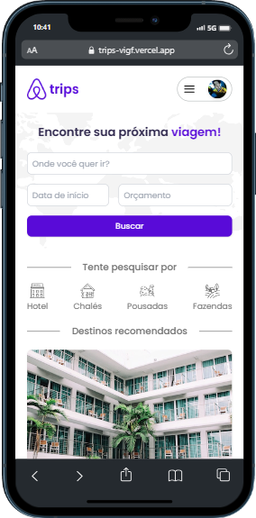
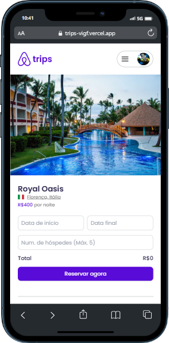
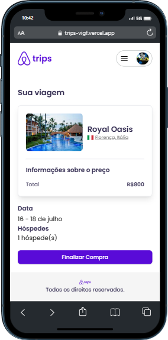
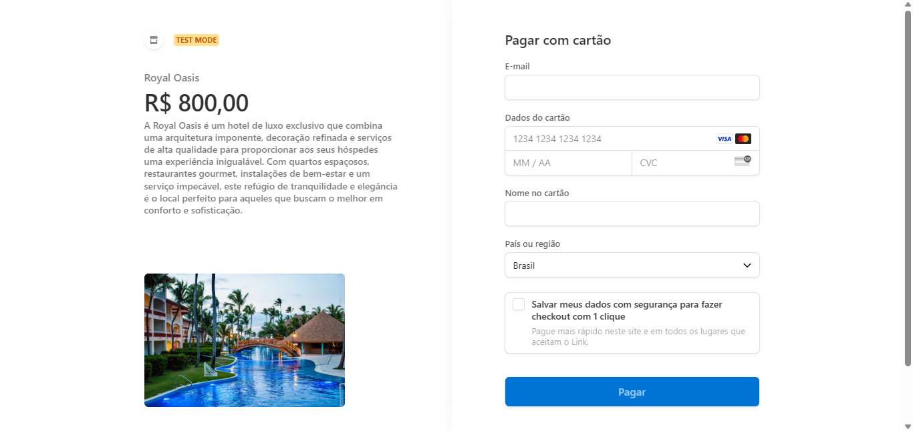

# Trips
Crie sua conta rapidamente utilizando o Google, depois disso você pode pesquisar por diferentes acomodações, fazer sua reserva e realizar o pagamento. Todas as suas reservas ficam salvas na sua conta e podem ser canceladas a qualquer momento. Aplicação desenvolvida durante o evento online FullStackWeek.







## ✨ Tecnologias
- Next.js | TypeScript | TailwindCSS | Prisma | Next Auth | Stripe | date-fns

## 🔖 Layout
Você pode visualizar o layout do projeto através [desse link](https://www.figma.com/file/84FUk0o5u8pFDSxCqwUC18/FSW-Project-%5BLive%5D?type=design&node-id=194%3A1733&mode=dev).

## 💻 Uso
Para testar o método de pagamento atrvés do deploy, insira o número:
4242 4242 4242 4242 como cartão de crédito fictício

Para testar localmente, crie sua aplicação através do Github e preencha as variáveis ambientes em um arquivo chamado .env.
Depois, em seu terminal:
```bash
# Clone o repositório
git clone https://github.com/ViGF/trips.git
# Acesse a pasta back-end do projeto
cd trips
# Instale as dependências
npm i
# Execute a aplicação
npm run dev
```

Foi a primeira vez que utilizei o Stripe. É um pouco difícil mas a incrível facilidade que traz é motivo de sobra para aprender.